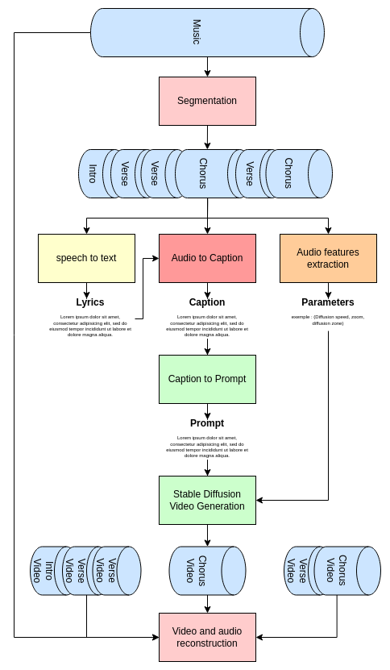

# Projet Master



## File structure

- Scripts: Scripts for working on HPC


## Set up your virtual env 
### Install virtual env
```
pip install virtualenv
```
OR
```
pip3 install virtualenv
```

### Set up "env" virtualenv
```
python3 -m virtualenv env
```

### Activate virtualenv
```
source env/bin/activate
```

### Install your dependencies from requirements.txt
```
pip install -r requirements/requirements.txt
```